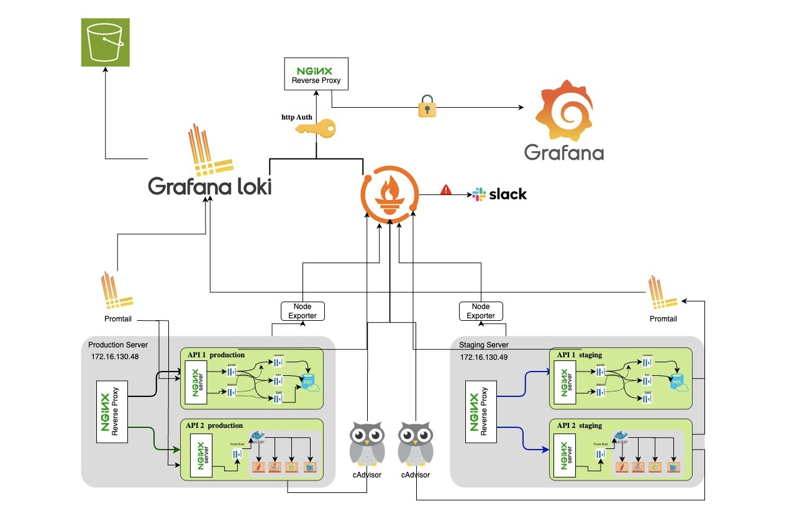

# prod-grade-monitoring-stack

A **production-grade, containerized monitoring stack** for full infrastructure observability. This stack includes:

- **Prometheus**: Metrics collection and alerting
- **Grafana**: Dashboards and visualization
- **Loki**: Log aggregation (single-node or distributed)
- **Promtail**: Log shipping to Loki
- **Alertmanager**: Alert routing and notifications
- **Node Exporter**: Host metrics
- **Blackbox Exporter**: Endpoint probing
- **cAdvisor**: Container metrics

---

## 📦 Architecture




---

## 🏗️ Component Hierarchy & Deployment

### **Monitoring Server (Central)**
This is where you run the main monitoring stack:
- **Prometheus**: Central metrics collection and storage
- **Grafana**: Dashboards and visualization
- **Loki**: Central log aggregation
- **Alertmanager**: Alert routing and notifications
- **Blackbox Exporter**: Endpoint probing (can monitor external services)

### **Remote Servers (Targets)**
On each server you want to monitor, you need to install:
- **Promtail**: Log collection and shipping to central Loki
- **Node Exporter**: Host-level metrics (CPU, memory, disk, network)
- **cAdvisor**: Container metrics (if running containers)

### **Deployment Flow**
1. **Central Setup**: Deploy the monitoring stack on your central server
2. **Target Setup**: Install exporters on each remote server you want to monitor
3. **Configuration**: Configure Prometheus to scrape metrics from remote exporters
4. **Log Collection**: Configure Promtail on remote servers to ship logs to central Loki

---

- The entrypoint script (`entrypoint.sh`) automatically substitutes environment variables from `.env` into all configuration files at runtime.
- All sensitive data (passwords, API keys, IPs) are stored in the `.env` file and should never be committed to version control.

---

## 🚀 Quick Start

1. **Clone the repository**
   ```sh
   git clone <repo-url>
   cd prod-grade-monitoring-stack
   ```

2. **Configure your environment**
   ```sh
   # Copy the example environment file
   cp .env.example .env
   
   # Edit the .env file with your specific values
   nano .env
   ```

3. **Update critical variables in `.env`:**
   ```sh
   # Network Configuration
   CENTRAL_SERVER_IP=your_server_ip
   REMOTE_SERVER_1_IP=remote_server_ip
   
   # Authentication (CHANGE THESE!)
   GRAFANA_ADMIN_PASSWORD=your_secure_password
   JENKINS_PASSWORD=your_jenkins_password
   
   # External Services
   SLACK_WEBHOOK_URL=https://hooks.slack.com/services/YOUR/SLACK/WEBHOOK
   AWS_S3_BUCKET_NAME=your-loki-logs-bucket
   AWS_ACCESS_KEY_ID=your_access_key
   AWS_SECRET_ACCESS_KEY=your_secret_key
   
   # Monitoring Targets
   TARGET_URL_1=https://your-first-target.com
   TARGET_URL_2=https://your-second-target.com
   TARGET_URL_3=https://your-third-target.com
   ```

4. **Start the stack using the entrypoint script**
   ```sh
   # Make the entrypoint script executable
   chmod +x entrypoint.sh
   
   # Run the script (it will substitute env vars and start services)
   ./entrypoint.sh
   ```

5. **Access the services:**
   - Prometheus: http://localhost:${PROMETHEUS_PORT:-9090}
   - Grafana: http://localhost:${GRAFANA_PORT:-3000}
   - Loki: http://localhost:${LOKI_PORT:-3100}
   - Alertmanager: http://localhost:${ALERTMANAGER_PORT:-9093}
   - Blackbox Exporter: http://localhost:${BLACKBOX_PORT:-9115}
   - Node Exporter: http://localhost:${NODE_EXPORTER_PORT:-9100}
   - cAdvisor: http://localhost:${CADVISOR_PORT:-8081}

---

## 🔐 Environment Configuration & Security

### **Environment Variables Structure**
The `.env` file contains all configurable parameters organized by category:

```bash
# Port Configuration
PROMETHEUS_PORT=9090
GRAFANA_PORT=3000
# ... other ports

# Network Configuration  
CENTRAL_SERVER_IP=172.16.130.44
REMOTE_SERVER_1_IP=172.16.130.49
# ... other IPs

# Authentication & Security
GRAFANA_ADMIN_PASSWORD=secure_password_here
JENKINS_PASSWORD=your_jenkins_password
# ... other credentials

# External Services
SLACK_WEBHOOK_URL=https://hooks.slack.com/services/YOUR/SLACK/WEBHOOK
AWS_S3_BUCKET_NAME=your-loki-logs-bucket
# ... other external services
```

### **Security Best Practices**
1. **Never commit `.env` to version control**
   ```bash
   # Add to .gitignore
   echo ".env" >> .gitignore
   echo ".env.*" >> .gitignore
   ```

2. **Use strong, unique passwords**
   ```bash
   # Generate secure passwords
   openssl rand -base64 32  # For Grafana admin
   openssl rand -base64 32  # For Jenkins
   ```

3. **Rotate credentials regularly**
   - Update passwords monthly
   - Rotate API keys quarterly
   - Review access permissions

4. **Environment-specific configurations**
   ```bash
   # Development
   cp .env .env.dev
   
   # Staging  
   cp .env .env.staging
   
   # Production
   cp .env .env.prod
   ```

### **Configuration Validation**
Before starting the stack, validate your configuration:
```bash
# Check if all required variables are set
./entrypoint.sh --validate

# Test configuration without starting services
./entrypoint.sh --dry-run
```

---

## 📝 Loki Distributed Mode

- Split Loki into multiple services: distributor, ingester, querier, query-frontend, compactor, etc.
- Use a shared ring backend (e.g., Consul, etcd, DynamoDB) instead of `inmemory`.
- Example Docker Compose services:
  ```yaml
  loki-distributor:
    image: grafana/loki:2.9.4
    command: -target=distributor -config.file=/etc/loki/config.yaml
    # ...
  loki-ingester:
    image: grafana/loki:2.9.4
    command: -target=ingester -config.file=/etc/loki/config.yaml
    # ...
  # Add querier, query-frontend, compactor, etc.
  consul:
    image: consul
    ports:
      - "8500:8500"
  ```
- Update `loki-config.yml` to use Consul or another supported backend for the ring.

See [Loki distributed docs](https://grafana.com/docs/loki/latest/operations/distributed/) for full details.

---

## 🛠️ Customization & Extending

### **Adding New Exporters**
```bash
# 1. Add exporter to docker-compose.yml
# 2. Add scrape configuration to prometheus/prometheus.yml
# 3. Use environment variables for configuration
```

### **Custom Alerting Rules**
```yaml
# Edit prometheus/alert.rules.yml
groups:
  - name: custom-alerts
    rules:
      - alert: HighCPUUsage
        expr: 100 - (avg by(instance) (rate(node_cpu_seconds_total{mode="idle"}[5m])) * 100) > 80
        for: 5m
        labels:
          severity: warning
        annotations:
          summary: "High CPU usage on {{ $labels.instance }}"
```

### **Notification Channels**
```yaml
# Edit alertmanager/config.yml
receivers:
  - name: 'email-notifications'
    email_configs:
      - to: 'admin@company.com'
        from: 'alertmanager@company.com'
        smarthost: 'smtp.company.com:587'
        auth_username: '${SMTP_USERNAME}'
        auth_password: '${SMTP_PASSWORD}'
```

### **Environment-Specific Configurations**
```bash
# Development
ENVIRONMENT=development
SCRAPE_INTERVAL=30s
PROMETHEUS_RETENTION_DAYS=7

# Production  
ENVIRONMENT=production
SCRAPE_INTERVAL=15s
PROMETHEUS_RETENTION_DAYS=30
```

---

## 🔧 Troubleshooting

### **Common Issues**

1. **Environment variables not substituted**
   ```bash
   # Check if .env file exists and has correct format
   cat .env | grep -v "^#" | grep -v "^$"
   
   # Verify entrypoint script permissions
   ls -la entrypoint.sh
   ```

2. **Services not starting**
   ```bash
   # Check logs
   docker-compose logs prometheus
   docker-compose logs grafana
   
   # Validate configuration
   docker-compose config
   ```

3. **Port conflicts**
   ```bash
   # Check if ports are already in use
   netstat -tulpn | grep :9090
   
   # Change ports in .env file
   PROMETHEUS_PORT=9091
   ```

4. **Authentication issues**
   ```bash
   # Reset Grafana admin password
   docker-compose exec grafana grafana-cli admin reset-admin-password newpassword
   
   # Check credentials in .env
   grep -E "(PASSWORD|SECRET)" .env
   ```

### **Debug Mode**
```bash
# Run with verbose logging
./entrypoint.sh --debug

# Check configuration without starting services
./entrypoint.sh --dry-run
```

---

## 📚 References
- [Prometheus Docs](https://prometheus.io/docs/)
- [Grafana Docs](https://grafana.com/docs/grafana/latest/)
- [Loki Docs](https://grafana.com/docs/loki/latest/)
- [Alertmanager Docs](https://prometheus.io/docs/alerting/latest/alertmanager/)
- [Blackbox Exporter](https://github.com/prometheus/blackbox_exporter)
- [cAdvisor](https://github.com/google/cadvisor)

---
